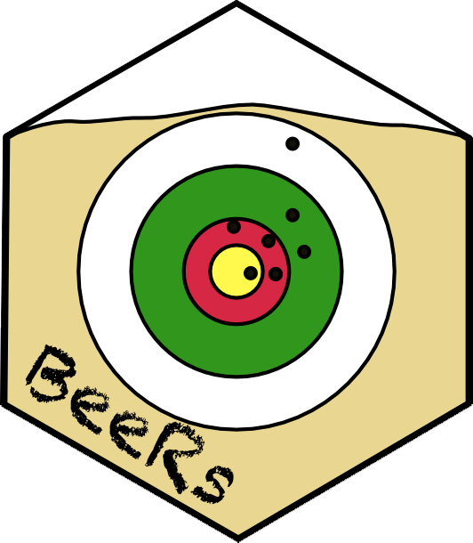

<!-- README.md is generated from README.Rmd. Please edit that file -->

```{r, include = FALSE}
knitr::opts_chunk$set(
  collapse = TRUE,
  comment = "#>",
  fig.path = "man/figures/README-",
  out.width = "100%"
)
```

# BeeRs

<!-- badges: start -->



<!-- badges: end -->

The goal of BeeRs is to explore a beer related dataset

## Installation

You can install the development version of BeeRs from [GitHub](https://github.com/) with:

``` r
# install.packages("devtools")
devtools::install_github("pmoizerv/BeeRs")
```

## Example

This is a basic example which shows you how to solve a common problem:

```{r example}
library(BeeRs)
x <- c(1,2,3,4,5)
almost(x, N = 1)
```

## Data

The data come from Kaggle

-   [Beer production per state](https://www.kaggle.com/datasets/jessemostipak/beer-production)
-   The data describe the production of beers in USA state from 2008 to 2019

## Function

The main function is `almost()` that compute the mean with an increased variance with increased beer consumption up to 7 beers, then is no longer able to calculate ...

## Workflow

```{mermaid}
flowchart LR
  A[GitHub repository]  --> B[Get data]
  B --> C(Process,\nfilter,\ntidy the data)
  C --> D{Merge the\ndatasets}
  D --> E[Create beeRs packages]
  D --> F[Create shiny app]
  E --> G(Create the quarto presentation)
```
